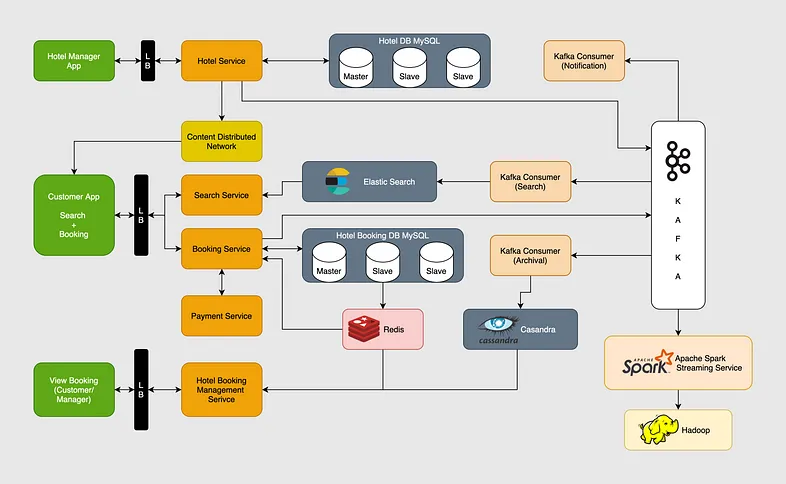

# requirement-analysis
Requirement Analysis in Software Development.

This Reposetory is about Requirement Analysis in Software Development Life Cycle (SDLC). The Project focuses on understanding methodologies in Requirement Analysis for software development.This project simulates a real-world development scenario, emphasizing clarity, precision, and structure in defining requirements to set the stage for successful project execution.

# What is Requirement Analysis?
    Requirement Analysis is a critical phase in the software development lifecycle (SDLC) where the project team gathers, analyzes, and defines the requirements of the software product to be developed. This process ensures that all stakeholders have a clear and mutual understanding of what the system should do and how it should perform.

# Why is Requirement Analysis Important?
 
    - Clarity and Understanding: It helps in understanding what the stakeholders expect from the software, reducing ambiguity. 

    - Scope Definition: Clearly defines the scope of the project, which helps in preventing scope creep.

    - Basis for Design and Development: Provides a solid foundation for designing and developing the system.

    - Cost and Time Estimation: Facilitates accurate estimation of project cost, resources, and time.

    - Quality Assurance: Ensures that the final product meets the specified requirements, leading to higher customer satisfaction.

_____________________________________________________________________________________________________

# Key Activities in Requirement Analysis.

- 1. Requirement Gathering 🗂️

    Interviews: Conducting interviews with stakeholders to gather detailed information about their needs and expectations.
    Surveys/Questionnaires: Distributing surveys to collect requirements from a larger audience.
    Workshops: Organizing workshops with stakeholders to discuss and gather requirements.
    Observation: Observing end-users in their working environment to understand their needs.
    Document Analysis: Reviewing existing documentation and systems to understand current functionalities and requirements.

- 2. Requirement Elicitation ✍️

    Brainstorming: Conducting brainstorming sessions to generate ideas and gather requirements.
    Focus Groups: Holding focus group discussions with selected stakeholders to gather detailed requirements.
    Prototyping: Creating prototypes to help stakeholders visualize the system and refine their requirements.

- 3. Requirement Documentation 📚

    Requirement Specification Document: Creating a detailed document that lists all functional and non-functional requirements.
    User Stories: Writing user stories to describe functionalities from the user’s perspective.
    Use Cases: Creating use case diagrams to show interactions between users and the system.

- 4. Requirement Analysis and Modeling 📊

    Requirement Prioritization: Prioritizing requirements based on their importance and impact on the project.
    Feasibility Analysis: Assessing the feasibility of requirements in terms of technical, financial, and time constraints.
    Modeling: Creating models (e.g., data flow diagrams, entity-relationship diagrams) to visualize and analyze requirements.

- 5. Requirement Validation ✅

    Review and Approval: Reviewing the documented requirements with stakeholders to ensure accuracy and completeness.
    Acceptance Criteria: Defining clear acceptance criteria for each requirement to ensure they meet the expected standards.
    Traceability: Establishing traceability matrices to ensure all requirements are addressed during development and testing.
___________________________________________________________________________________________________

# Types of Requirements.

# 1. Functional Requirements ⚙️

    Definition: Describe what the system should do.

    Examples: User authentication, property search, booking system, user registration.

    Key Functional Requirements:
        Search Properties: Users should be able to search for properties based on various criteria such as location, price, and availability.
        User Registration: New users should be able to create an account with personal details and login credentials.
        Property Listings: Display properties with essential details and images.
        Booking System: Users should be able to book properties, view booking details, and manage their bookings.
        User Authentication: Secure login and registration process for users.

# 2. Non-functional Requirements 🛡️

    Definition: Describe how the system should perform.

    Examples: Performance, security, scalability, usability, reliability.

    Key Non-functional Requirements:
        Performance: The system should load pages within 2 seconds and handle up to 1000 concurrent users.
        Security: Ensure data encryption, secure login, and protect against common vulnerabilities.
        Scalability: The system should be able to scale horizontally to handle increased traffic.
        Usability: The application should have an intuitive UI/UX, making it easy for users to navigate and perform tasks.
        Reliability: The system should have an uptime of 99.9% and recover quickly from any failures.

_____________________________________________________________________________________________________
# Use Case Diagrams 📊

Visual representation of interactions between users and the system.

    - What are Use Case Diagrams?

        Use case diagrams show how different users (actors) interact with the system to achieve specific goals (use cases).

    - Creating Use Case Diagrams:
        Identify actors (e.g., guest, registered user, admin).
        Define use cases (e.g., search properties, book property, manage listings).
        Draw interactions between actors and use cases.

    - Benefits of Use Case Diagrams:
        Provide a clear visual representation of system functionalities.
        Help in identifying and organizing system requirements.
        Facilitate communication among stakeholders and development team.

# Customer Service (Search + Booking):
This is the service that will be given to customers. In this customers can search and book a hotel. Here customers have a separate portal to access the data and process it.

The customer app hit’s the API then the load balancer redirect and distribute the request to the respective service to process the request. Here we have two services one for searching for a hotel and a booking service to book the hotel and booking service also interacts with the payment service which will be a third-party service.

The search service has to get the data from Elastic Search. Elasticsearch is a NoSQL Database that is best for its search engine functionality.

The booking service communicates with Redis and the booking database cluster. Redis is caching system, that’s stores temporary data so that data need not fetched database and which could eventually reduce the load in the database also reduce the response time of API.

Any changes made in the database will be sent to the messaging queue. Then the consumer will take the data from the queue and put it to Casandra. For archival we are using Casandra because with time data size will increase in the database, increasing query time. So that’s why we may need to delete old data from the database. And Casandra is a NoSQL database that is good at handling a high volume of data.

# View Booking Service
The Customer/Manager app sends the request to the load balancer and it distributes the request to booking management servers. Then the service request for data through Redis and Cassandra. through Redis, it requests recent data as it is a caching server. Which could reduce the loading time on the app side.

there is a Kafka consumer for notification, notification consumers send the notification. That could be to the customer/manager, like whenever a customer books a hotel notification is sent to the manager or if a new offers come it’s notified to the customer.

Apache Streaming service takes the data from messaging queue and stores it in Hadoop which could be used for BigData analysis for multiple purposes. Like business analysis, finding potential customers, audience categorisations etc.

____________________________________________________________________________________________________
# Acceptance Criteria ✅

    What is Acceptance Criteria?
        Acceptance criteria are conditions that a feature must meet to be accepted by the stakeholders.

    How to Define Acceptance Criteria:
        Be specific and measurable.
        Include functional and non-functional aspects.

    Importance of Acceptance Criteria:

        Ensure all parties have a clear understanding of feature requirements.
        Provide a basis for testing and validation.
        Help in maintaining quality and meeting user expectations

         Example for Booking System(Checkout feature): 
         
         “ The system should allow users to filter search results by date, price, and location, add property to their cart, proceed to checkout, showcase property details, enter billing information, select a payment method, and receive an order confirmation upon successful payment. ”

